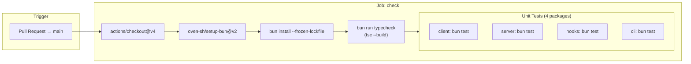
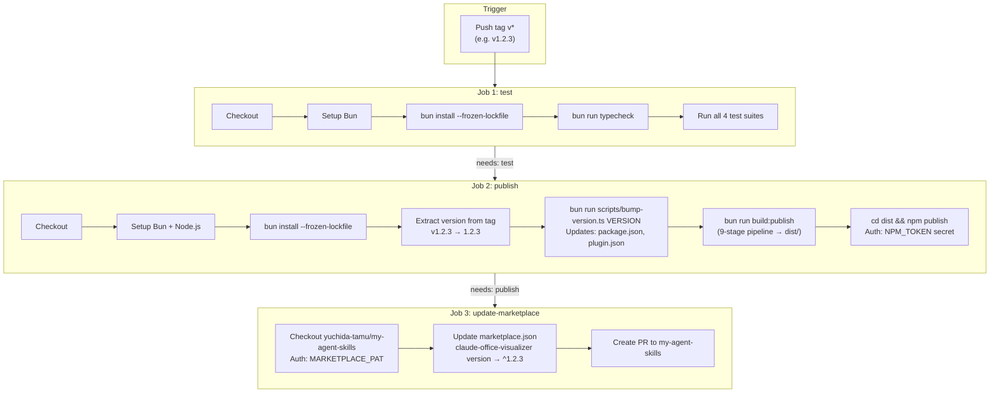
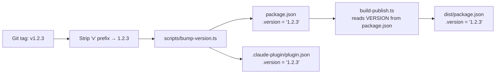

# CI/CD Pipeline Data Flow

## Overview

Two GitHub Actions workflows automate quality checks and releases:
1. **PR Check** — validates every pull request before merge
2. **Build & Publish** — triggered by version tags, publishes to npm and updates the plugin marketplace

---

## PR Check Workflow

---

## Build & Publish Workflow

---

## Version Bump Data Flow

---

## Required Secrets

| Secret | Used In | Purpose |
|--------|---------|---------|
| `NPM_TOKEN` | Job 2: publish | npm registry authentication |
| `MARKETPLACE_PAT` | Job 3: update-marketplace | GitHub PAT with repo scope for `yuchida-tamu/my-agent-skills` |
