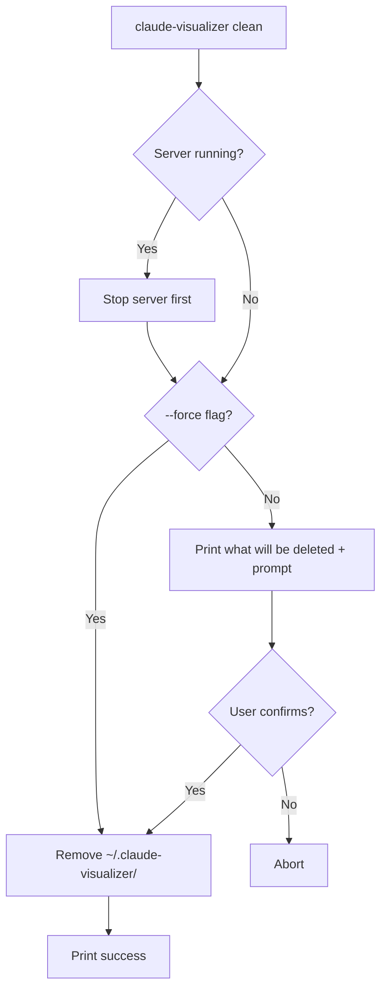

# CLI `clean` Command — Data Flow

## Overview

Adds a `claude-visualizer clean` command that removes all locally persisted data (`~/.claude-visualizer/`), with a `--force` flag to skip confirmation.

## Flow

## Files removed

- `~/.claude-visualizer/data.db` — SQLite database
- `~/.claude-visualizer/data.db-wal` — WAL journal
- `~/.claude-visualizer/data.db-shm` — shared memory
- `~/.claude-visualizer/server.pid` — PID file
- `~/.claude-visualizer/` — the directory itself
