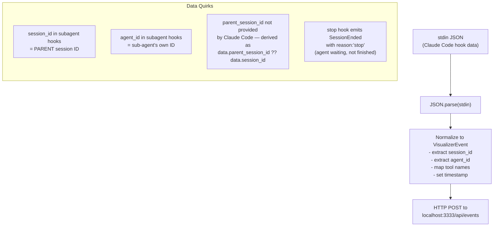
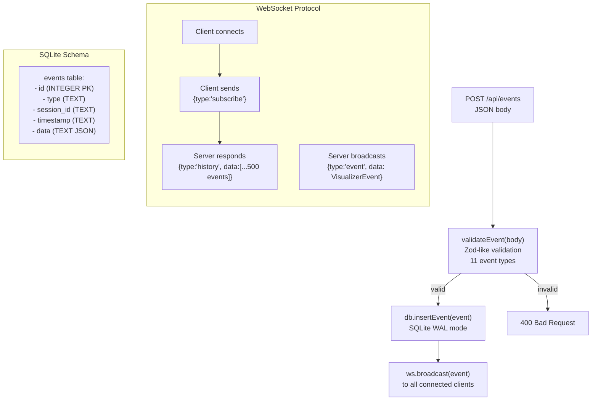
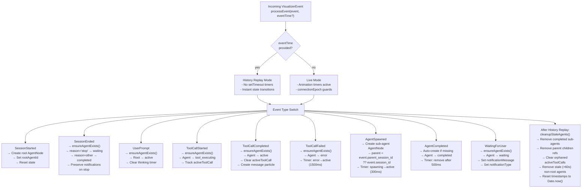
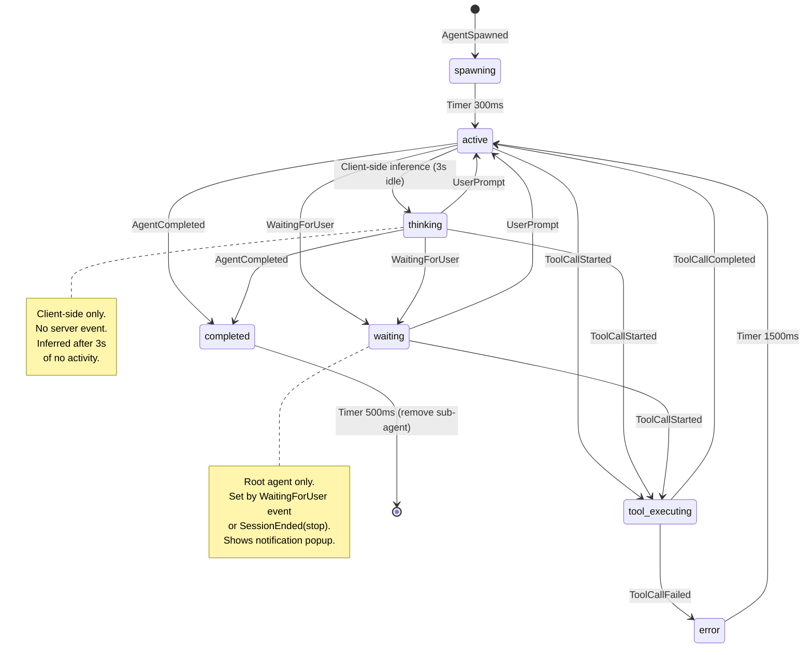
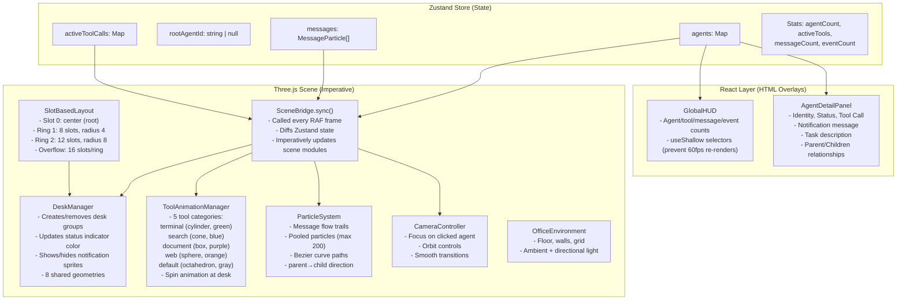
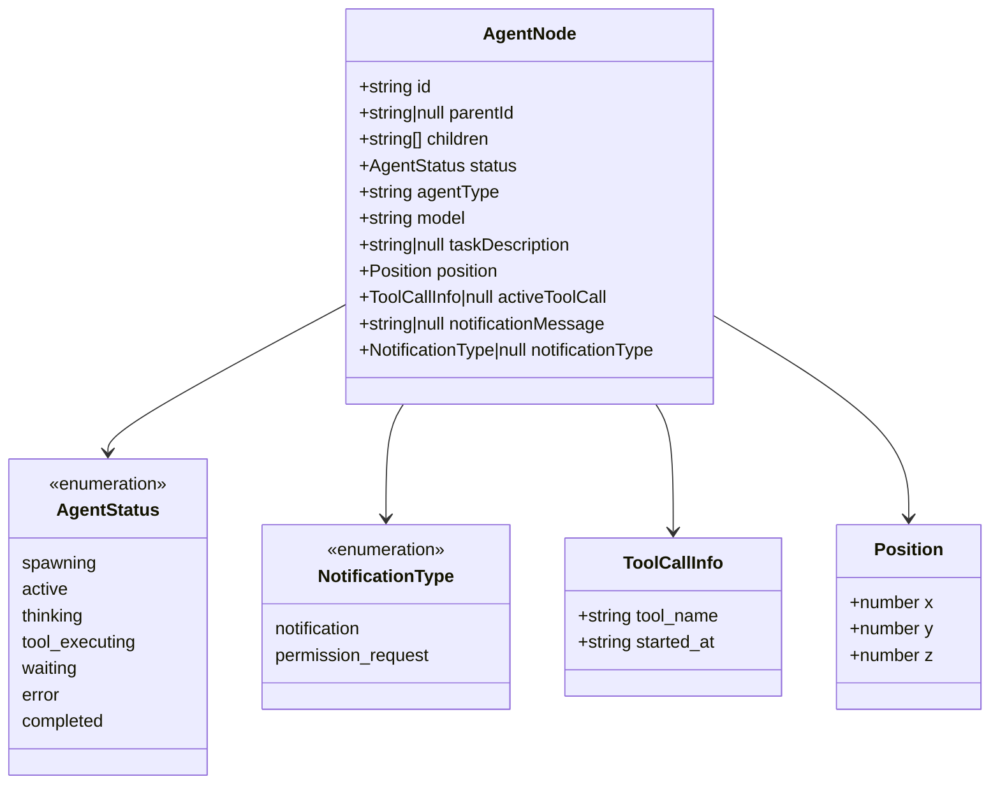
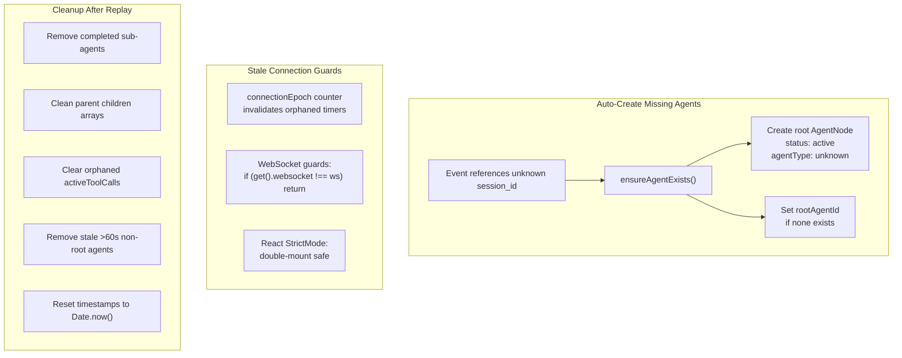

# Claude Office Visualizer — Data Flow

## End-to-End Pipeline

```mermaid
flowchart LR
    subgraph CC["Claude Code"]
        hooks_trigger["Lifecycle Events"]
    end

    subgraph Hooks["Hook Scripts (hooks/src/)"]
        direction TB
        h1["session-start.ts"]
        h2["session-end.ts"]
        h3["prompt-submit.ts"]
        h4["stop.ts"]
        h5["tool-start.ts"]
        h6["tool-end.ts"]
        h7["tool-error.ts"]
        h8["subagent-start.ts"]
        h9["subagent-stop.ts"]
        h10["notification.ts"]
        h11["spawn.ts"]
        h12["shutdown.ts"]
    end

    subgraph Server["Bun Server (server/src/)"]
        direction TB
        routes["routes.ts\nPOST /api/events"]
        validation["validation.ts\nvalidateEvent()"]
        db["database.ts\nSQLite WAL mode"]
        ws["websocket.ts\nbroadcast()"]
    end

    subgraph Client["React Client (client/src/)"]
        direction TB
        store["Zustand Store\nuseVisualizerStore.ts"]
        react["React Components\nGlobalHUD, AgentDetailPanel"]
        scene["3D Scene\nSceneBridge + SceneManager"]
    end

    hooks_trigger --> Hooks
    Hooks -- "HTTP POST JSON\n(fire & forget, 5s timeout)" --> routes
    routes --> validation
    validation --> db
    validation --> ws
    ws -- "WebSocket\n{type:'event', data}" --> store
    db -- "WebSocket subscribe\n{type:'history', data:[...]}" --> store
    store -- "Zustand selectors\n(useShallow)" --> react
    store -- "SceneBridge.sync()\nevery RAF frame" --> scene
```

## Event Type Mapping

```mermaid
flowchart LR
    subgraph HookScripts["Hook → Event Type"]
        direction TB
        A1["session-start.ts → SessionStarted"]
        A2["session-end.ts → SessionEnded"]
        A3["prompt-submit.ts → UserPrompt"]
        A4["stop.ts → SessionEnded (reason:'stop')"]
        A5["tool-start.ts → ToolCallStarted"]
        A6["tool-end.ts → ToolCallCompleted"]
        A7["tool-error.ts → ToolCallFailed"]
        A8["subagent-start.ts → AgentSpawned"]
        A9["subagent-stop.ts → AgentCompleted"]
        A10["notification.ts → WaitingForUser"]
        A11["spawn.ts → SpawnEvent"]
        A12["shutdown.ts → ShutdownEvent"]
    end
```

## Hook Script Data Flow (stdin → HTTP POST)

## Server Processing

## Zustand Store Event Processing

## Agent State Lifecycle

## Client Rendering Pipeline

## AgentNode Data Model

## Key Resilience Patterns

