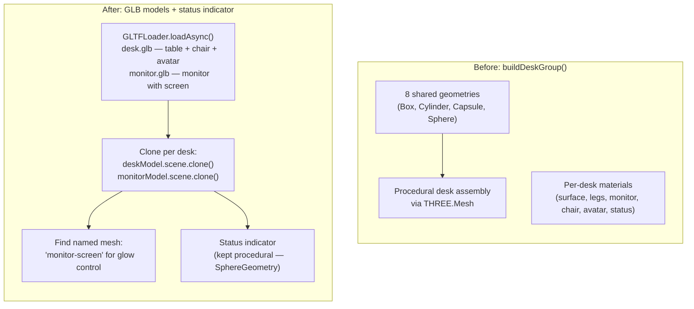
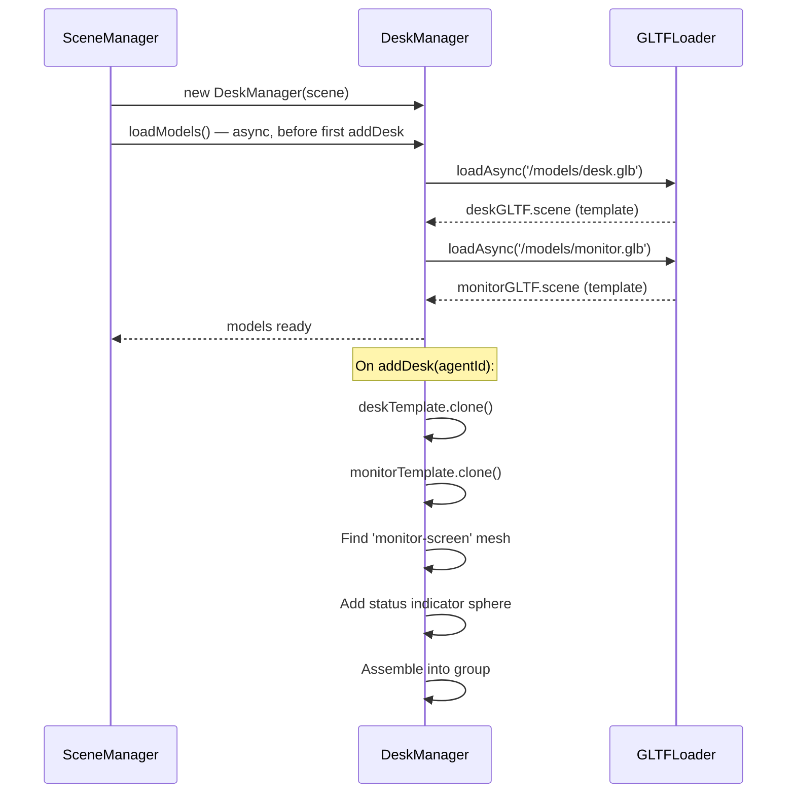
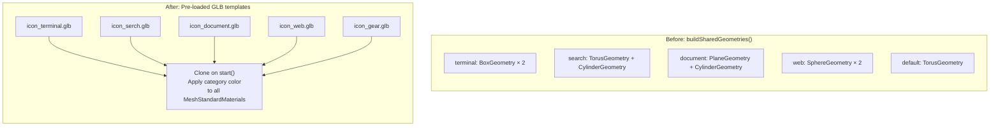

# Desk & Tool Icons: GLB Model Replacement

## DeskManager — Before (Procedural) → After (GLB)

## Model Loading Strategy

## ToolAnimationManager — Before (Procedural) → After (GLB)

## Key Decisions

| Aspect | Decision |
|--------|----------|
| Loading | Models loaded once via async `loadModels()`, called from `SceneManager.init()` |
| Cloning | `gltf.scene.clone()` per desk / per tool icon start |
| Monitor screen | The GLB `monitor.glb` must have a mesh named `monitor-screen` for emissive glow control |
| Status indicator | Kept as procedural SphereGeometry (needs dynamic color/emissive per frame) |
| Desk shared geometries | Removed — no more BoxGeometry, CylinderGeometry, CapsuleGeometry |
| Tool shared geometries | Removed — no more procedural icon construction |
| Shadows | Traverse cloned models, set receiveShadow/castShadow on all meshes |
| Color application | Tool icons: traverse meshes, set emissive to category color |
| Dispose | Traverse clones and dispose geometries + materials |
