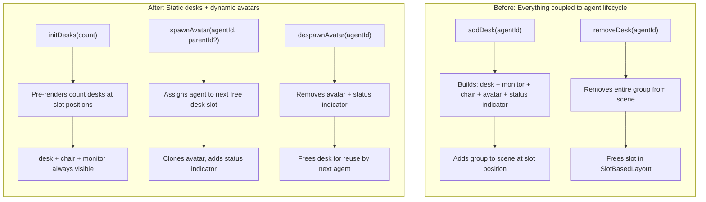
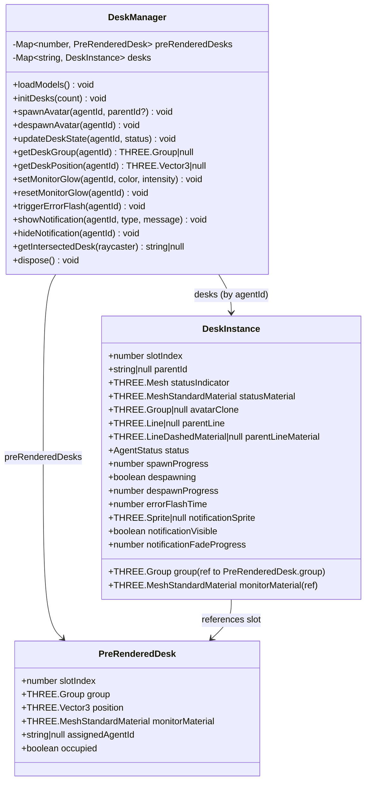
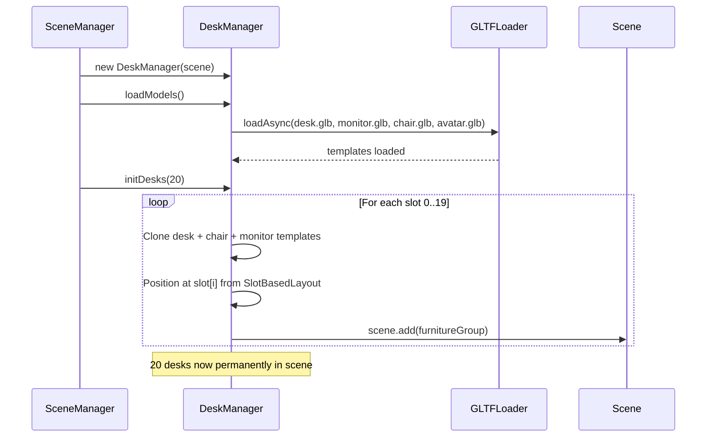
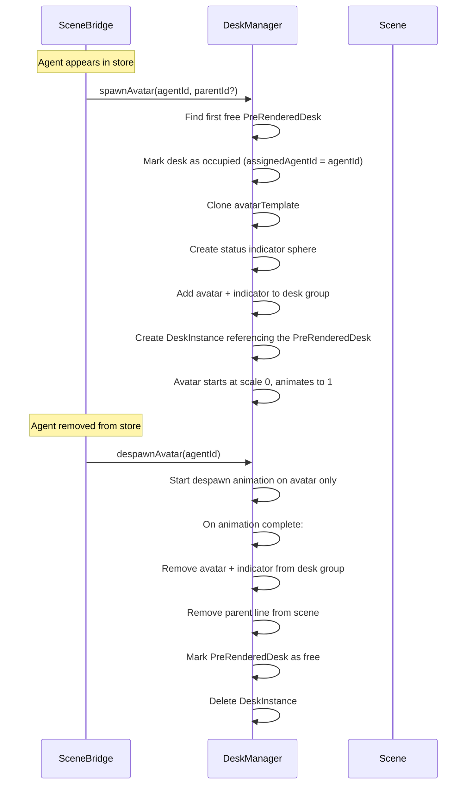
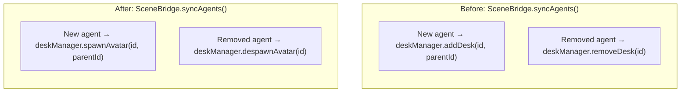
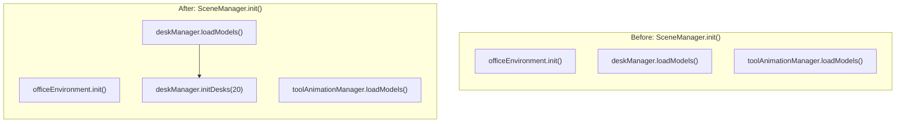

# Desk/Avatar Separation: Pre-rendered Desks with Dynamic Avatars

## Overview

Separate static office furniture (desk, chair, monitor) from dynamic agent avatars. Desks are pre-rendered at all slot positions on scene init and remain permanently visible. Only avatars spawn/despawn with agent lifecycle events.

## Before → After: DeskManager API

## Data Model Changes

## Initialization Sequence

## Agent Spawn/Despawn Flow

## SceneBridge Changes

## SceneManager Changes

## Key Design Decisions

| Aspect | Decision |
|--------|----------|
| Pre-rendered count | 20 desks (slot 0 center + ring 1 (8) + ring 2 first 11) — configurable via `initDesks(count)` |
| Desk occupancy | PreRenderedDesk tracks `assignedAgentId` and `occupied` flag |
| Avatar animation | Only avatar + status indicator animate on spawn/despawn, desk furniture stays at full scale |
| Slot assignment | Uses SlotBasedLayout internally — agent→slot mapping for avatars only |
| Monitor glow | Works per-desk via PreRenderedDesk.monitorMaterial — same API, but referenced through DeskInstance |
| Backward compat | `addDesk`/`removeDesk` deprecated in favor of `spawnAvatar`/`despawnAvatar` |
| Click detection | `getIntersectedDesk` checks all pre-rendered desk groups but only returns agentId for occupied desks |
| Dispose | Pre-rendered desks are cleaned up in `dispose()` along with any active agent instances |
