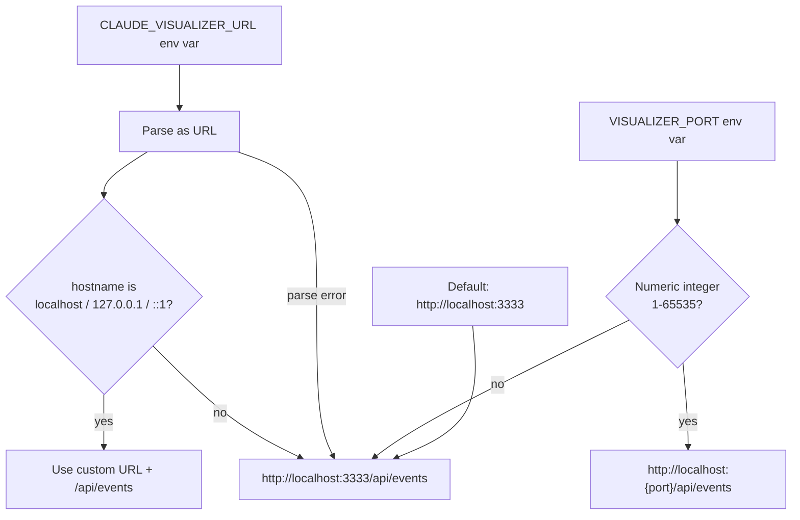
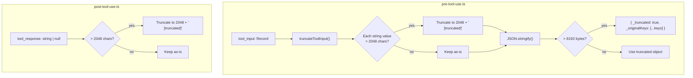
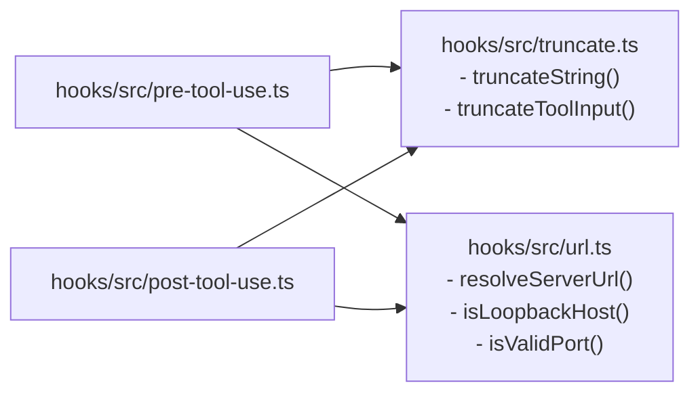

# Hooks Input Validation & Truncation

Security hardening for hook scripts: validate URL inputs and truncate large payloads.

## URL Validation (resolveServerUrl)

## Payload Truncation (pre-tool-use & post-tool-use)

## Module Structure

