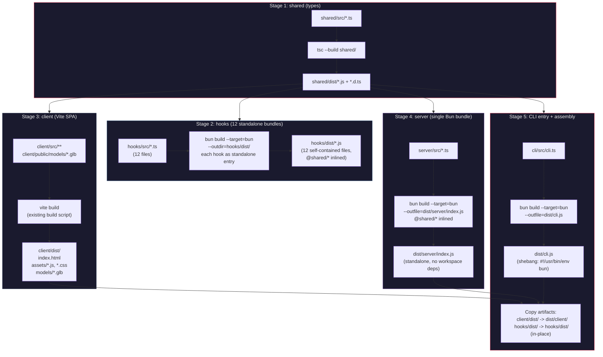
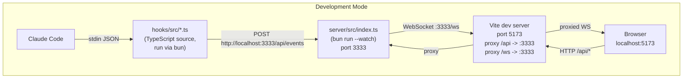
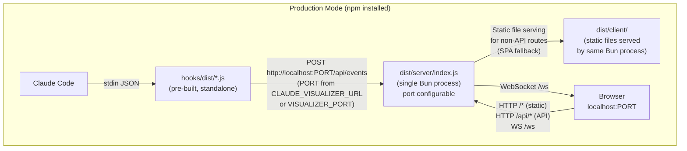
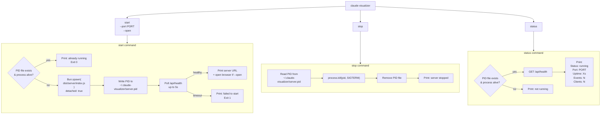
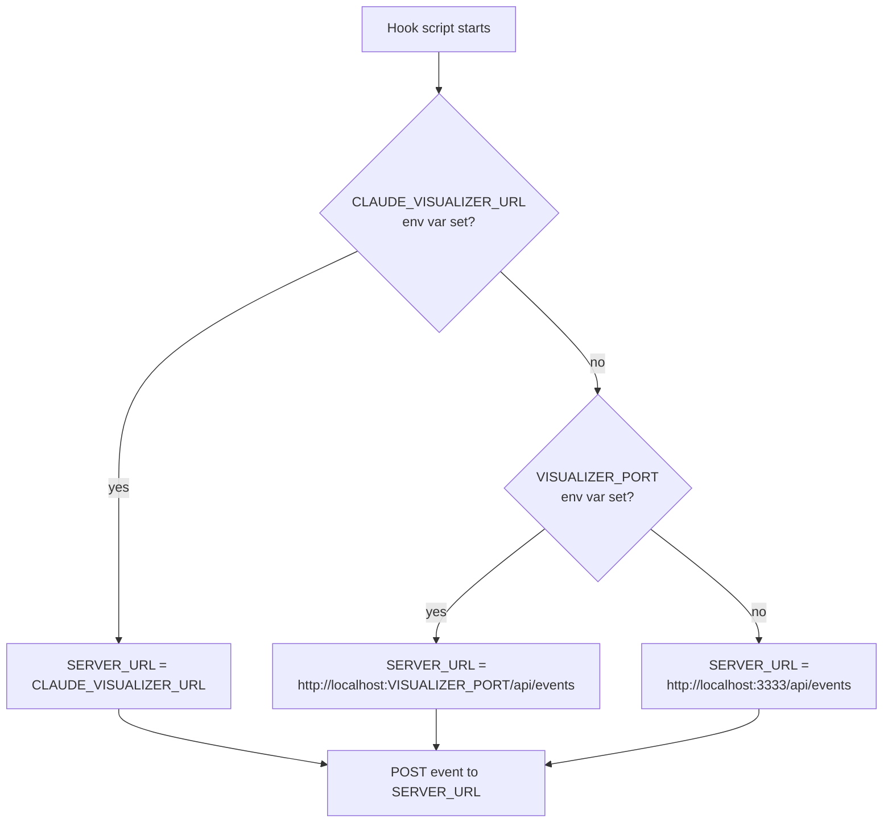
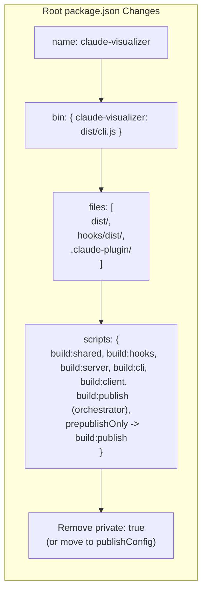
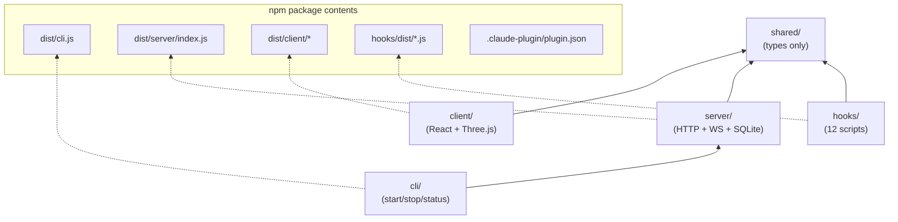

# npm CLI + Claude Code Plugin Packaging (YUC-107)

## Overview

This document describes the build pipeline, distribution structure, and runtime data flows
for packaging claude-office-visualizer as both an npm-installable CLI tool and a standalone
Claude Code plugin.

---

## 1. Build Pipeline

The build pipeline has five stages executed in strict dependency order. Each stage
produces artifacts consumed by the next.



### Build orchestration script (`build:publish`)

```
bun run build:shared       # Stage 1 - tsc (already exists)
bun run build:hooks        # Stage 2 - bun build x12
bun run build:client       # Stage 3 - vite build (already exists)
bun run build:server       # Stage 4 - bun build server
bun run build:cli          # Stage 5 - bun build cli + assemble
```

---

## 2. Final dist/ Structure (npm package contents)

```
package root/
  package.json            # bin: { "claude-visualizer": "dist/cli.js" }
  dist/
    cli.js                # #!/usr/bin/env bun - CLI entry point
    server/
      index.js            # Bundled server (shared types inlined)
    client/
      index.html          # SPA entry
      assets/             # JS, CSS bundles
      models/             # GLB 3D models (office, desk, icons, etc.)
  hooks/
    dist/                 # Bundled hook scripts (standalone .js)
      session-start.js
      session-end.js
      subagent-start.js
      subagent-stop.js
      pre-tool-use.js
      post-tool-use.js
      post-tool-use-failure.js
      user-prompt-submit.js
      stop.js
      notification.js
      permission-request.js
      pre-compact.js
  .claude-plugin/
    plugin.json           # Uses ${CLAUDE_PLUGIN_ROOT} paths
```

---

## 3. Runtime Data Flow: Development Mode (unchanged)

This is the existing workflow. Nothing changes here. Both Vite dev server and
Bun server run separately with hot reload.



Key: In dev mode, hooks import `@shared/*` via workspace resolution and
TypeScript paths. The Vite dev server proxies API and WebSocket traffic. No
build step needed for hooks or server.

---

## 4. Runtime Data Flow: Production / npm-installed Mode

After `npm install -g claude-visualizer` (or `bunx claude-visualizer`), the CLI
starts a single Bun process that serves both the API and the built client.



Key differences from dev mode:
- Single process: server serves both API and static client files
- No Vite proxy: browser connects directly to the Bun server
- Hooks are pre-built JS: no workspace resolution, no TypeScript compilation
- Database defaults to `~/.claude-visualizer/data.db` (not CWD)

---

## 5. CLI Command Flow



---

## 6. Server Static File Serving (Production Mode Detection)

```mermaid
flowchart TD
    req["Incoming HTTP Request"]
    req --> is_ws{pathname === '/ws'?}
    is_ws -->|yes| ws_upgrade["WebSocket upgrade\n(existing logic)"]
    is_ws -->|no| is_api{pathname starts\nwith '/api/'?}
    is_api -->|yes| api_routes["handleRequest()\n(existing routes.ts)"]
    is_api -->|no| has_client{CLIENT_DIR exists?\n(production mode)}
    has_client -->|no| not_found["404 Not Found\n(dev mode: Vite handles client)"]
    has_client -->|yes| try_static["Attempt to serve\nstatic file from\nCLIENT_DIR + pathname"]
    try_static --> file_exists{File found?}
    file_exists -->|yes| serve_file["Serve file with\ncorrect Content-Type"]
    file_exists -->|no| spa_fallback["Serve CLIENT_DIR/index.html\n(SPA fallback)"]
```

The server detects production mode by checking for the existence of the built
client directory relative to its own location (`../client/index.html` from
`dist/server/index.js`). In development, this directory does not exist, so the
server returns 404 for non-API routes (Vite handles them via proxy).

---

## 7. Hook Portability: URL Resolution

All 12 hooks currently hardcode `http://localhost:${VISUALIZER_PORT || 3333}/api/events`.
The change adds `CLAUDE_VISUALIZER_URL` as the primary override.



---

## 8. Plugin.json Transformation

Current (development -- relative paths, TypeScript source):
```json
{
  "hooks": {
    "SessionStart": [
      { "type": "command", "command": "bun run hooks/src/session-start.ts" }
    ]
  }
}
```

Target (distribution -- CLAUDE_PLUGIN_ROOT paths, pre-built JS):
```json
{
  "hooks": {
    "SessionStart": [
      { "type": "command", "command": "bun run ${CLAUDE_PLUGIN_ROOT}/hooks/dist/session-start.js" }
    ]
  }
}
```

The source plugin.json stays as-is for development. The build pipeline generates
the distribution version in the output directory, or the source is updated to use
`${CLAUDE_PLUGIN_ROOT}` and the development workflow uses a separate local override.

Decision: Keep two plugin.json variants:
- `.claude-plugin/plugin.json` -- committed, uses `${CLAUDE_PLUGIN_ROOT}` paths
  pointing to `hooks/dist/*.js` (works for both npm-installed and plugin installs)
- `.claude/settings.local.json` -- local dev override, not committed, uses
  `bun run hooks/src/*.ts` for development with hot TypeScript execution

---

## 9. Package.json Configuration for npm Publishing



---

## 10. Database Path Resolution

```mermaid
flowchart TD
    init["initDatabase(path?)"]
    init --> has_arg{path argument\nprovided?}
    has_arg -->|yes| use_arg["Use provided path"]
    has_arg -->|no| check_env{VISUALIZER_DB_PATH\nenv var set?}
    check_env -->|yes| use_env["Use env var path"]
    check_env -->|no| check_mode{Production mode?\n(running from dist/)"}
    check_mode -->|yes| use_home["~/.claude-visualizer/data.db\n(mkdir -p the directory)"]
    check_mode -->|no| use_cwd["visualizer.db\n(current directory, existing behavior)"]

    use_arg --> open_db["Open SQLite database"]
    use_env --> open_db
    use_home --> open_db
    use_cwd --> open_db
```

---

## 11. Dependency Graph Summary


