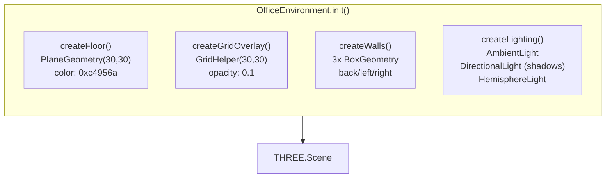
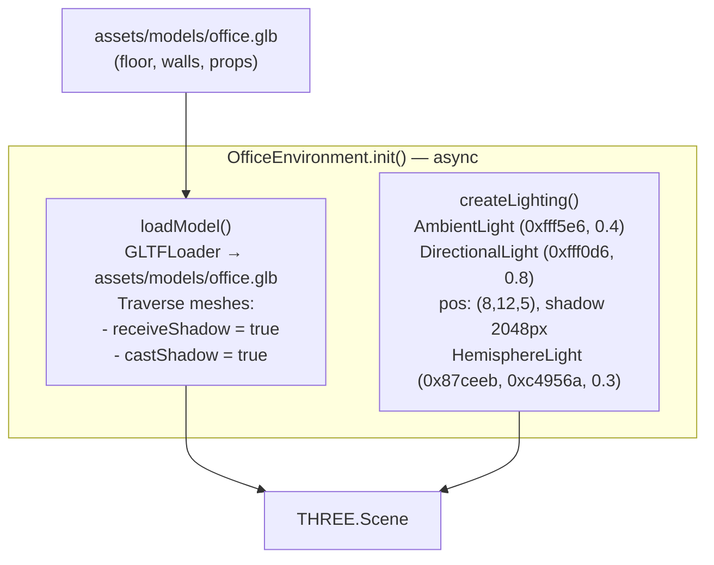

# Office Environment: GLB Model Replacement

## Before (Procedural Geometry)

## After (GLB Model + Procedural Lighting)

## Changes

| Component | Before | After |
|-----------|--------|-------|
| Floor | `PlaneGeometry(30,30)` procedural | Part of `office.glb` |
| Grid overlay | `GridHelper(30,30)` | Removed (part of model or not needed) |
| Walls (3x) | `BoxGeometry` procedural | Part of `office.glb` |
| Lighting | Procedural (3 lights) | **Kept as-is** (model has no lights) |
| `init()` return | `void` (sync) | `Promise<void>` (async GLB load) |
| Dispose | Dispose geometries + materials | Traverse and dispose GLB scene graph |

## Key decisions
- `init()` becomes async — `SceneManager.init()` already returns `Promise<void>`, so awaiting is natural
- Shadow settings applied by traversing all meshes in the loaded model
- GLB is imported as a static asset URL via Vite (`import modelUrl from '...'` or URL string)
- Lighting remains procedural — the model does not include lights
