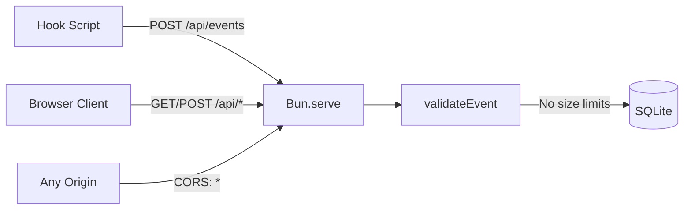
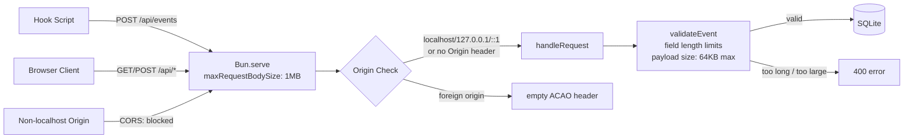

# Server Security Hardening

## Overview

Harden the server package against three High-severity security findings:
1. Unbounded request body size (memory exhaustion)
2. No string length limits in event validation (payload inflation)
3. Wildcard CORS origin (cross-origin abuse from non-localhost)

## Data Flow (Before)

## Data Flow (After)

## Fix Details

### Fix 1: maxRequestBodySize (index.ts)
- Add `maxRequestBodySize: 1_048_576` to `Bun.serve()` options
- Bun rejects bodies over 1MB automatically (413 status)
- No test needed; config-only change

### Fix 2: String length limits (validation.ts)
- `id`: max 256 chars
- `timestamp`: max 64 chars
- `session_id`: max 256 chars
- Overall payload: `JSON.stringify(body).length <= 65536` (64KB)
- Checks added after type checks, before final return

### Fix 3: Localhost-only CORS (routes.ts)
- Replace `Access-Control-Allow-Origin: *` with dynamic origin validation
- Allowed patterns: `http://localhost:*`, `http://127.0.0.1:*`, `http://[::1]:*`
- Requests without Origin header (curl, hooks, server-to-server) are allowed
- `corsHeaders(req)` function replaces static `CORS_HEADERS` object

## Design Decisions
- Requests without an Origin header are allowed through (non-browser clients)
- If Origin is present but not localhost, the response still returns but with no ACAO header, so the browser enforces the block
- The `json()` helper now needs the request passed through for CORS header generation
