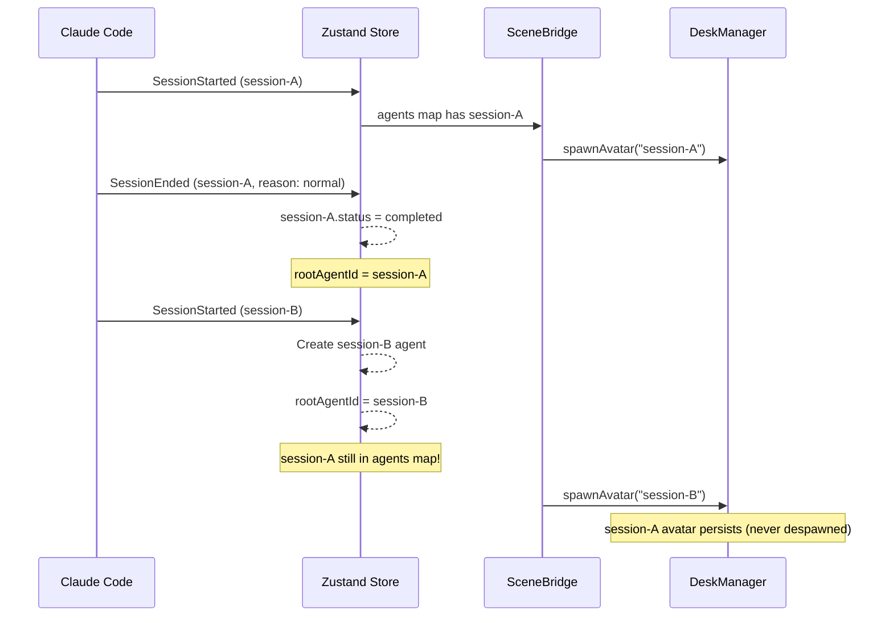
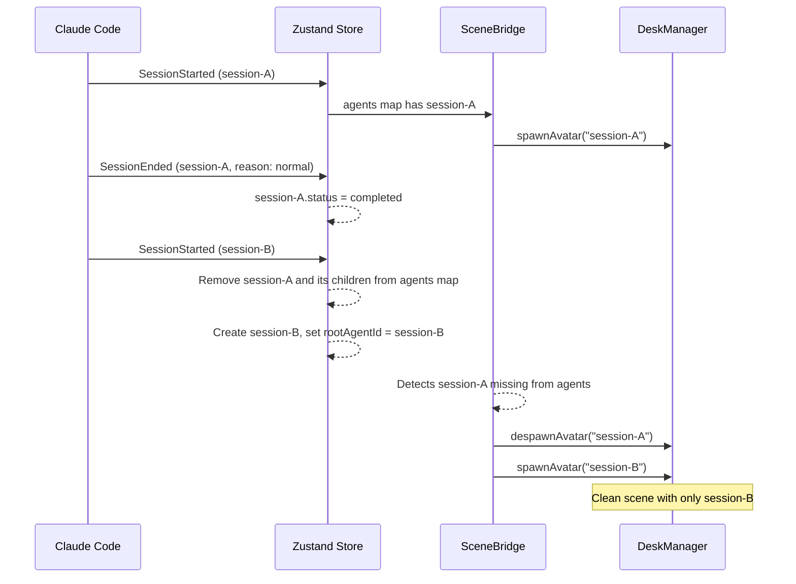

# Session Restart: Old Root Agent Cleanup

## Bug

When a new `SessionStarted` event arrives, the previous root agent (completed)
remains in the Zustand store and its avatar persists in the 3D scene. Over
multiple session restarts, dormant completed avatars accumulate.

## Root Cause

## Fix

## Edge Cases (all covered by tests)

- Previous root has sub-agents (children) → remove entire subtree
- Previous root is in "waiting" status (stop between turns) → still remove
- SessionStarted with same session_id as current root → no-op (idempotent)
- Active tool calls on removed agents → cleared from activeToolCalls map
- History replay: multiple SessionStarted events in batch → only latest survives

## Implementation

**Two coordinated changes:**

### 1. Store (`client/src/store/useVisualizerStore.ts` — `SessionStarted` case)

Before creating the new root agent, if a previous root exists with a different
ID, recursively delete it and all its children from the agents map. Collect any
`activeToolCall.tool_use_id` from removed agents and delete them from
`activeToolCalls`. SceneBridge detects the missing agents on next sync and
calls `despawnAvatar()` for each.

### 2. DeskManager (`client/src/scene/DeskManager.ts` — `despawnAvatar()`)

Immediately free the pre-rendered desk slot (`prd.assignedAgentId = null`) when
despawn starts, rather than waiting for the fade-out animation to complete in
`cleanupAvatar()`. This allows `spawnAvatar()` to reuse the same desk in the
same frame — critical for session restart where the old root is removed and the
new root is spawned in a single `SceneBridge.sync()` call. The leader desk
(slot 0, front-center) is always reused by the new root agent.
