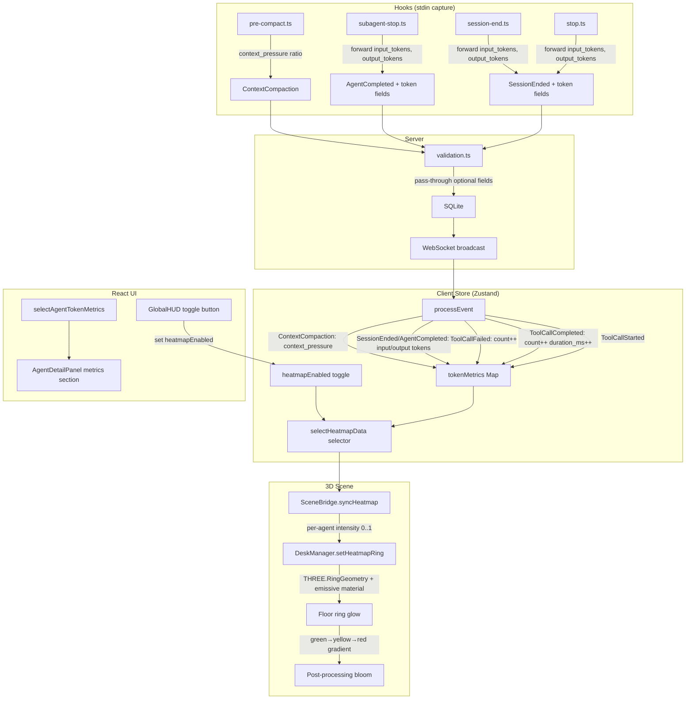

# Token Usage Heatmap — Data Flow

## Overview

Visualizes per-agent resource consumption as a color-coded heatmap ring beneath each desk in the 3D scene. Uses **tool call activity** (count + cumulative duration) as the baseline metric, with optional **token usage fields** forwarded from Claude Code hooks when available.

## Data Sources

### Baseline (always available)
- **ToolCallCompleted** events: `duration_ms` field, counted per agent
- **ToolCallStarted** events: counted per agent
- **ToolCallFailed** events: counted per agent

### Extended (when Claude Code provides them)
- **SessionEnded**: optional `input_tokens`, `output_tokens`
- **AgentCompleted**: optional `input_tokens`, `output_tokens`
- **ContextCompaction**: existing `context_pressure` (ratio 0..1)

## Data Flow



## TokenMetrics Type (per agent)

```typescript
interface TokenMetrics {
  toolCallCount: number;       // Total tool calls (started + auto-created)
  toolCallDurationMs: number;  // Sum of ToolCallCompleted.duration_ms
  failedToolCalls: number;     // Count of ToolCallFailed
  inputTokens: number;         // From SessionEnded/AgentCompleted (0 if unavailable)
  outputTokens: number;        // From SessionEnded/AgentCompleted (0 if unavailable)
  contextPressure: number;     // Latest ContextCompaction ratio (0..1)
}
```

## Heatmap Intensity Calculation

Normalized per-session (relative to max across all agents):

```
activityScore = (toolCallCount * 100) + toolCallDurationMs
tokenScore = inputTokens + outputTokens  (when > 0, overrides activityScore)
intensity = agentScore / maxScoreAcrossAgents  (0..1)
```

## Visual Design

- **Ring geometry**: `THREE.RingGeometry(innerRadius=1.3, outerRadius=1.8)` placed at y=0.02 beneath desk
- **Color gradient**: intensity 0..1 maps to green (0x4ade80) → yellow (0xfbbf24) → red (0xef4444)
- **Emissive glow**: `emissiveIntensity` = 0.3 + intensity * 0.7, picked up by bloom pass
- **Toggle**: Off by default. GlobalHUD shows a small "Heatmap" toggle button
- **Agent Detail Panel**: Shows token metrics breakdown when agent is focused

## History Replay Handling

Token metrics accumulate during history replay just like live events. No special handling needed since TokenMetrics is purely additive (no timers). On `SessionStarted` (new session), metrics for the previous session's agents are cleared along with the agents themselves.

## Reset Behavior

- `reset()`: Clears `tokenMetrics` map along with other state
- `SessionStarted` with new session: Previous agent subtree removal also clears their metrics
- `cleanupStaleAgents`: Metrics entries for removed agents are cleaned up
